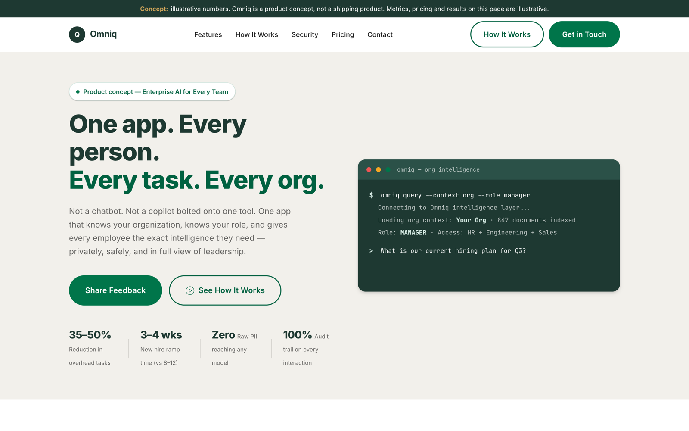

# Omniq

[](https://github.com/sandeepvijayarao09/Omniq/actions/workflows/links.yml)

A single-page concept site for **Omniq**, an idea for an enterprise AI layer that sits between employees and LLMs: it grounds answers in company context, tokenizes sensitive data before any model call, enforces role-based access and logs every interaction.

**Live:** https://sandeepvijayarao09.github.io/Omniq/



> **Concept only.** Omniq is not a company or a shipping product. Every metric, price and "result" on the page is illustrative, and the page says so in a banner at the top. There is no backend: the contact form opens a pre-filled email draft and stores nothing.

## Highlights

- Static HTML, CSS and vanilla JavaScript. No framework, no build step, no dependencies.
- Responsive layout with a sticky nav, mobile menu and active-section highlighting.
- Animated hero terminal that types through a sample org-intelligence query.
- Interactive role tabs (Basic, Pro, Manager, Admin, Executive).
- Scroll-triggered fade-ins via `IntersectionObserver`.
- Sections for the problem, features, request flow, security model, role tiers, an illustrative pricing model and target outcomes.

## Run locally

```bash
git clone https://github.com/sandeepvijayarao09/Omniq.git
cd Omniq
python3 -m http.server 8000
# open http://localhost:8000
```

Opening `index.html` directly in a browser also works.

## Project structure

```
index.html          Page markup and all content sections
style.css           Design tokens, layout and components
main.js             Nav, role tabs, scroll animations, terminal typing, contact form
docs/screenshot.png README screenshot
```

## Deployment

GitHub Pages serves the `main` branch from the repository root. Pushing to `main` updates the live site.

## License

[MIT](LICENSE)
